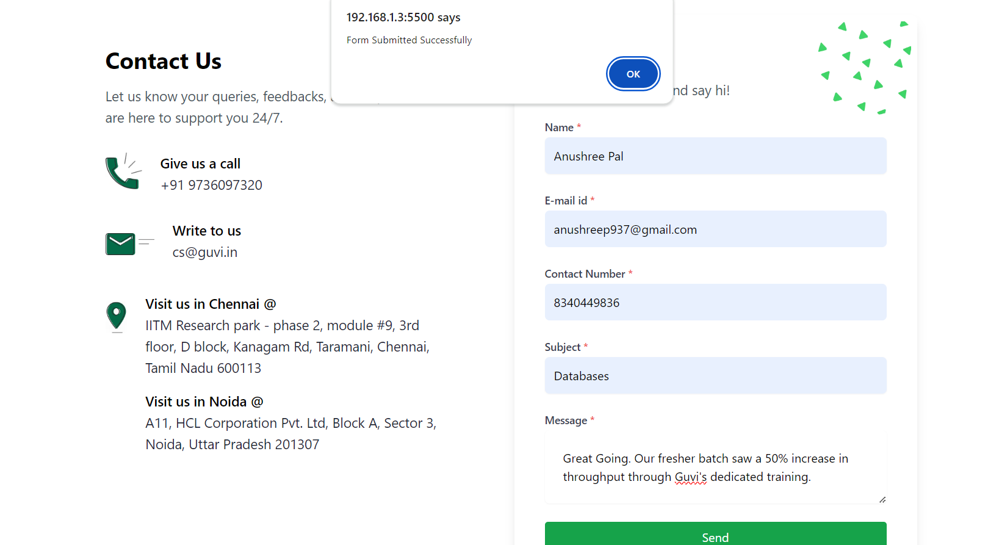
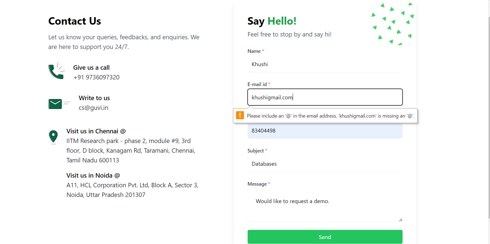
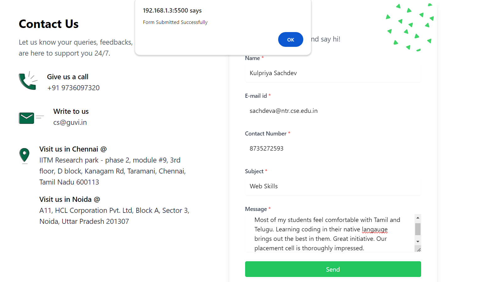
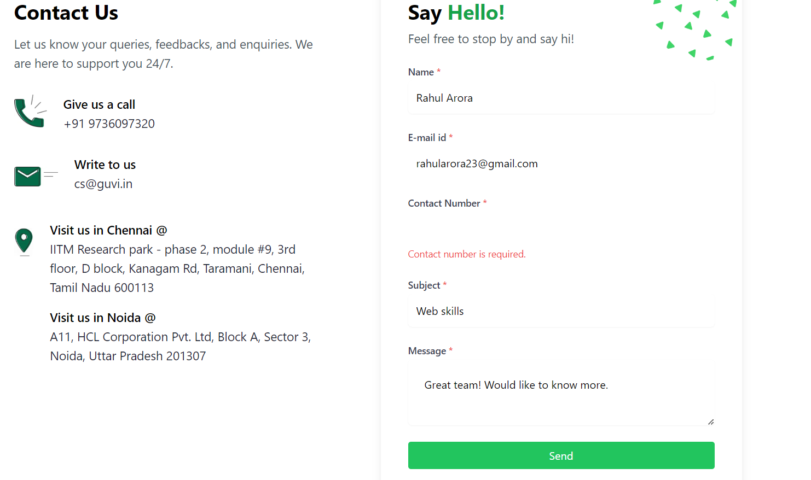
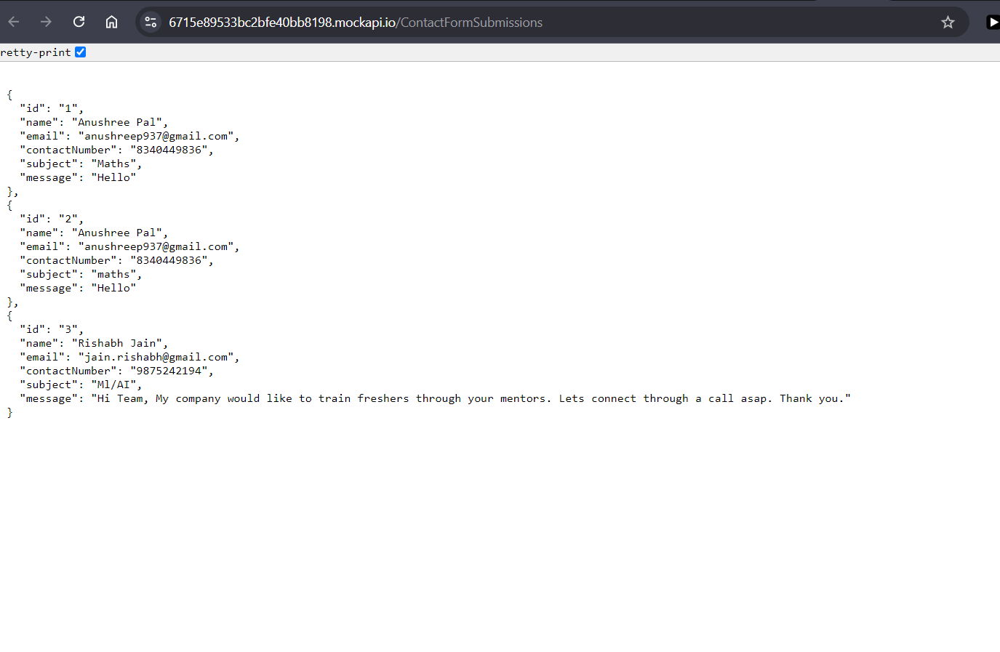
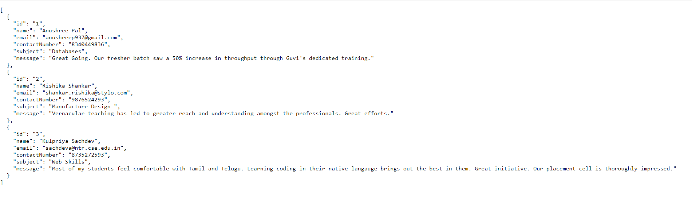
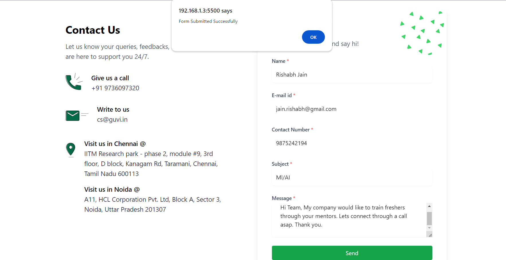
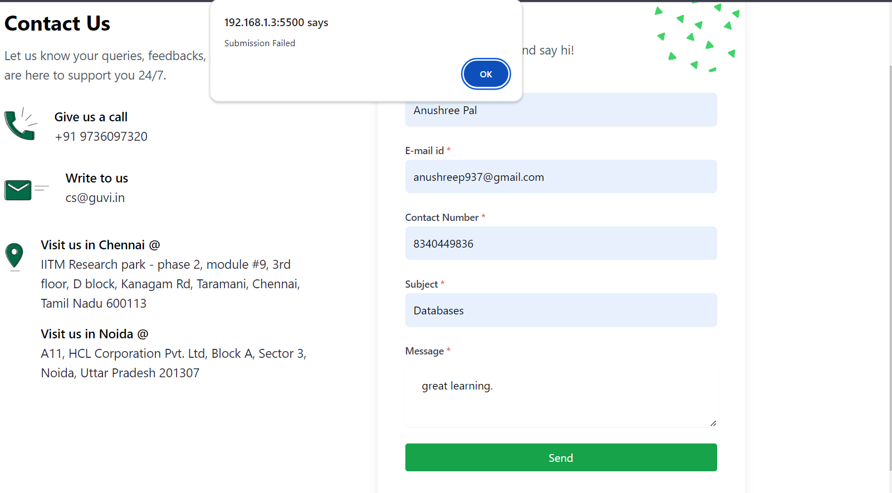

# Guvi Contact Form and MockAPI integration solution


## Table of contents

- [Overview](#overview)
  - [The challenge](#the-challenge)
  - [Screenshot](#screenshot)
  
- [My process](#my-process)
  - [Built with](#built-with)
  - [What I learned](#what-i-learned)
 

- [Acknowledgments](#acknowledgments)


## Overview

### The challenge


- You are required to build and submit the Guvi.in contact form using TypeScript.
- The form should contain the following fields:
  1. **Name**
  2. **Email**
  3. **Contact Number**
  4. **Subject**
  5. **Message**
  6. **Send Button**


### Screenshot




### Submission reflected on MockAPI endpoint



### Failed Submission



### Built with

- Semantic HTML5 markup

- Tailwindcss

- Typescript
- [Styled Components](https://styled-components.com/) - For styles


### What I learned

Usage of typescript in form validation. Usage of optional chaining syntax taught in morning sessions :
```
nameError?.classList.add("hidden");
    nameInput.classList.remove("border-red-500");
```


## Acknowledgments

Elan Sir and Gopi sir for teaching typescript code structure and best practices.


